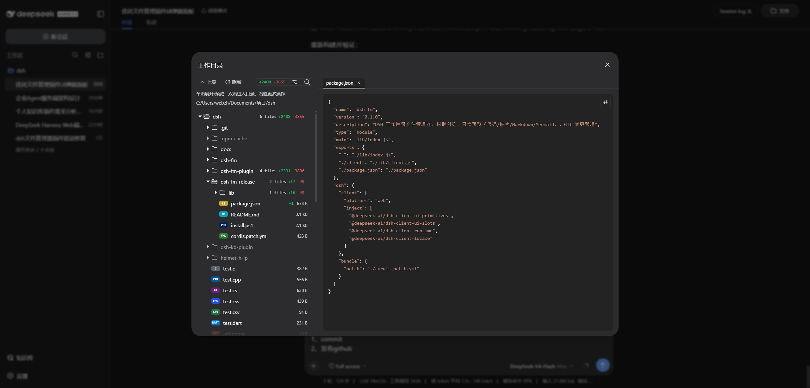

# dsh-fm — DSH 工作目录文件管理器

[](./LICENSE)

一个 [DeepSeek Harness (DSH)](https://www.npmjs.com/package/@deepseek-ai/dsh) Web 插件：在会话标题栏提供「文件」入口，树形浏览当前工作目录，只读预览代码/图片/Markdown/Mermaid，并可视化 Git 变更状态。完全开源。



## 功能特性

- **全局弹窗**：与 DSH 设置面板同款居中弹窗（遮罩模糊 + 圆角面板，Esc / 遮罩点击 / 关闭按钮均可关闭）；左侧为文件目录树与全部相关功能，右侧为预览面板
- **树形浏览**：单击展开/收起，双击进入目录，标题可一键回到工作区根
- **预览面板**：默认常显（无打开文件时显示空态引导），多选项卡（上限 20），代码语法着色（30+ 语言）、图片、Markdown 渲染（含 Mermaid 图；`.md` 默认渲染预览，可一键切回源码）；选项卡右键菜单提供「关闭当前 / 右侧 / 左侧 / 其他 / 全部」五种关闭模式（无可关闭对象时禁用但保留显示）
- **Git 可视化**：
  - 工具栏 +/− 总变更、提交按钮（↓ 图标）、「仅显示变更文件」筛选
  - 文件行 +/− 徽标；目录行聚合徽标（`N files +X −Y`，悬停看明细）
  - 未被 git 索引（未跟踪/被 .gitignore 忽略）的文件与文件夹整体暗色显示
- **右键菜单**：引用路径到会话输入框、删除（限工作目录内，二次确认）
- **体验细节**：上下滚动渐变蒙层、未索引内容悬停恢复亮度、250ms 手动双击检测、DSH 主题 token 自适应（深浅色跟随）

## 快速安装（免构建）

> 也可以直接下载现成安装包：**[Releases 页面](https://github.com/frankzhan-git/dsh-fm/releases)** 下载 `dsh-fm-0.1.0.zip`，解压后运行其中的 `install.ps1` 一键安装（内置安装/使用文档）。

直接安装本仓库（`lib/` 已包含预构建产物）：

```powershell
dsh plugin --profile web add "dsh-fm@github:frankzhan-git/dsh-fm"
```

然后创建中文显示名的目录联接（插件管理器显示「dsh文件管理器」；pnpm 不接受中文依赖键，中文名需通过联接解析）：

- **Windows**（PowerShell）：
  ```powershell
  cmd /c mklink /J "%USERPROFILE%\.dsh\profiles\node_modules\dsh文件管理器" "%USERPROFILE%\.dsh\profiles\web\node_modules\dsh-fm"
  ```
- **Linux / macOS**（bash）：
  ```bash
  ln -s ~/.dsh/profiles/web/node_modules/dsh-fm ~/.dsh/profiles/node_modules/dsh文件管理器
  ```

最后重启 DSH 并刷新页面。**如果不需要中文名**，把 `cordis.patch.yml` 中的 `name: dsh文件管理器` 改为 `name: dsh-fm` 即可跳过联接步骤（管理器将显示 "fm"）。

## 从源码构建

```bash
npm install
npm run build   # esbuild 打包 src/client.js → lib/client.js
```

- host 半（`lib/index.js`）为纯 ESM，无需构建
- 客户端 bundle 的 banner id 必须与 `cordis.patch.yml` 中的 `name` 一致
- 本仓库已提交 `lib/client.js`，克隆后不构建也可直接安装

## 项目结构

```
dsh-fm-plugin/
├── src/
│   ├── client.js              # 插件入口：样式注入 + 槽位注册（仅装配）
│   ├── core/                  # 纯逻辑（零 React 依赖）
│   │   ├── constants.js       #   全局常量（选项卡上限/轮询间隔/双击窗口/高亮上限）
│   │   ├── format.js          #   路径/大小/排序工具
│   │   ├── highlight.js       #   语法高亮分词（30+ 语言关键字表）
│   │   ├── diff.js            #   git diff 文本解析
│   │   ├── api.js             #   /api/fm RPC 封装
│   │   └── store.js           #   跨组件共享的轻量会话状态 + useOpen
│   ├── hooks/                 # 状态机（业务逻辑）
│   │   ├── useFmWorkspace.js  #   文件树（懒加载/轮询）+ git 状态（聚合徽标/筛选）
│   │   └── useFmPreviews.js   #   预览选项卡（打开/读取/区间关闭/删除联动清理）
│   ├── components/            # UI 组件（React.createElement）
│   │   ├── FmModal.js         #   弹窗控制器：编排两个 Hook + 行右键菜单/删除/引用
│   │   ├── TreePanel.js       #   左侧树列（工具栏/git/提交/列表行）
│   │   ├── PreviewPanel.js    #   右侧预览列（头部/选项卡/正文/空态/二次确认）
│   │   ├── TabBar.js          #   选项卡栏（渐隐蒙层 + 右键关闭菜单）
│   │   ├── ContextMenu.js     #   通用右键菜单（含 disabled 项）
│   │   ├── Markdown.js        #   Markdown 渲染 + Mermaid（mermaid 唯一引用点）
│   │   ├── FileBadge.js       #   文件类型徽标
│   │   └── FilesButton.js     #   会话标题栏「文件」入口
│   └── css/                   # 样式按区域拆分，构建时拼接
│       ├── base.js            #   弹窗壳/按钮/错误条/reduced-motion
│       ├── tree.js            #   树列样式
│       ├── preview.js         #   预览列样式
│       ├── menu.js            #   菜单/浮窗样式
│       └── index.js           #   FM_CSS 聚合
├── lib/
│   ├── index.js        # host 半：文件读写、git 命令、/api/fm 路由（纯 ESM，无需构建）
│   └── client.js       # 客户端预构建产物（esbuild 打包 src/** → 单个 ModuleLoader bundle，内联 Mermaid）
├── scripts/build.mjs   # esbuild 构建脚本（入口 src/client.js）
├── cordis.patch.yml    # profile bundle 补丁层（插件注册行）
└── package.json        # 包清单（dsh.bundle / dsh.client 声明）
```

> **架构约定**：`core/` 保持零 React 依赖、便于单测；`hooks/` 集中管理状态与副作用，组件保持「渲染 + 回调」薄层；新增功能优先落在对应模块，避免回退为单文件开发。`lib/client.js` 是 ModuleLoader 单 bundle 产物（加载器要求一个插件一个模块），源码层面已彻底模块化。

## 工作原理

- **host 半**注入 `fs / shell / sandboxPolicy / sessions / webServer` 服务，注册 `/api/fm` HTTP 路由分发全部 RPC（`fm-list / fm-read / fm-git-status / fm-git-diff / fm-git-commit / fm-remove / fm-mermaid-render`）
- **client 半**通过 `dsh.client` 声明加载，渲染文件树、预览与 Git UI，经 `fetch('/api/fm')` 与 host 通信
- 目录与 git 状态每 3 秒轮询一次；git 命令按「双 shell 兼容」约定编写（见下）

## 开发约定（重要）

- **Shell 兼容**：Windows 的 DSH shell 后端是 PowerShell，Linux/macOS 是 bash。所有 shell 命令必须两端兼容：只用普通命令串联 + `; echo 标记` 分段；禁止 `||`、`&&`、重定向、`if...fi`、`rm` 等单侧语法；确需分叉时用 `process.platform` 显式分支
- **host 插件必须声明 `inject`**：Loader 架构下 apply 会在依赖服务提供前执行，不声明 inject 时 `ctx.get(...)` 全为 undefined，路由不会注册
- **图标统一使用 DSH 内置图标库**（`@deepseek-ai/dsh-client-ui-primitives`），不自定义 SVG；新增图标时先查库内语义最接近的 glyph，并在 `dsh.client.inject` 中保持该依赖声明
- 插件管理器显示名取自 patch 行的 `name`（模块说明符），banner id 必须与之保持一致

## 许可证

[MIT](./LICENSE) © 2026 FrankZhan
